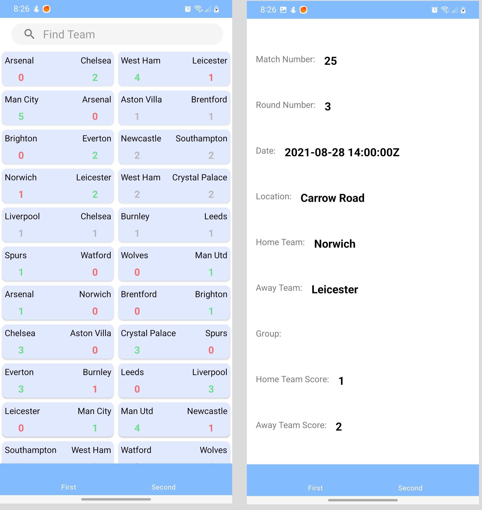

## Стек
* Kotlin
* XML
* Coroutines, Flow
* Retrofit
* Room
* Dagger2
* MVVM/Clean Arch

## Что реализовано
* Загрузка информации о матчах
* Кэширование в БД
* Поиск по названию команды
* Отображение детальной информации о матче

## Описание экранов
* DetailsFragment
    * Содержит инфорацию о матче
    * При нажатии на вторую кнопку в боттом нав баре, открывается детальная информация о первом матче

* ListFragment
    * Отображается список матчей (по умолчанию всех)
    * Когда вводим символы в строке поиска, данные фильтруются

### Скриншоты

  

### Видео

https://user-images.githubusercontent.com/91427690/213369334-18ba9344-f7fd-4a4d-8e65-1f7638eb6d18.mp4

